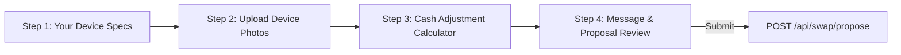
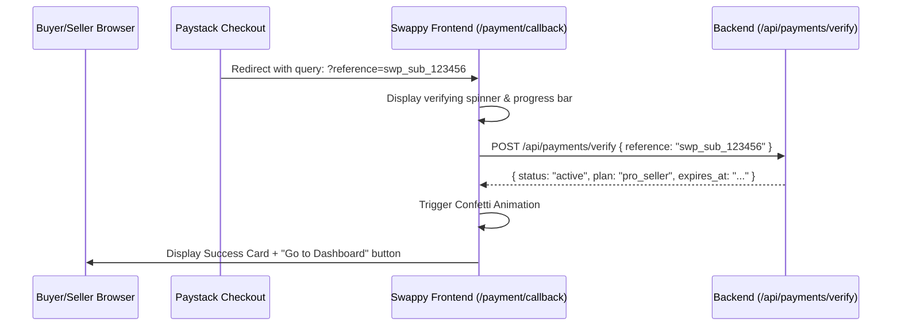

# Swappy Frontend Architecture: Public Marketplace & Visitor Logic (Non-Dashboard)

## 1. Scope & Objective

This document defines the complete frontend implementation specification for all **non-dashboard**, buyer-facing, and public visitor experiences in Swappy.

It strictly adheres to:
- **Bun runtime** (`bun install`, `bun run dev`, `bunx`)
- **DaisyUI v5** on **Tailwind CSS v4** with full light/dark theme support (`data-theme="light"` / `data-theme="dark"`)
- **No emojis** in any UI element or button (use `lucide-react` SVG icons exclusively)
- **SSR-First** via TanStack Start server functions (`createServerFn`)
- **Direct PocketBase SDK** integration with cookie-based SSR auth state

---

## 2. Public Route Map & Information Architecture

```
/
├── (Index / Homepage)               # Hero, quick search chips, promoted slider, recent feed
├── /explore                         # Full smartphone catalog with multi-facet sidebar filter
├── /items/:id                       # Rich device detail page, swap trigger, contact actions
├── /store/:slug                     # Verified merchant storefront, inventory & WhatsApp lead
├── /auth/login & /auth/signup       # Dedicated auth routes + AuthModal overlay
└── /payment/callback                # Paystack redirect destination & verification handshake
```

---

## 3. Route-by-Route Implementation Specifications

### 3.1 Homepage (`/`)

#### Purpose
Instant discovery of iPhones, high-conversion categories, active trade opportunities, and sponsored devices.

#### Component Breakdown & DaisyUI v5 Structure
```tsx
<div className="min-h-screen bg-base-100 text-base-content">
  {/* 1. Navbar */}
  <PublicNavbar />

  {/* 2. Hero Section with Quick Search */}
  <HeroSection>
    <div className="hero bg-base-200 py-12 px-4 rounded-3xl">
      <div className="hero-content text-center flex-col">
        <h1 className="text-4xl font-extrabold tracking-tight md:text-6xl">
          Buy, Sell & Swap SmartPhones in Nigeria
        </h1>
        <p className="py-4 text-base-content/80 max-w-xl text-lg">
          The verified marketplace for iPhones. Trade your current device with cash top-up or buy directly from verified merchants.
        </p>
        <QuickSearchBar />
        <ModelQuickChips />
      </div>
    </div>
  </HeroSection>

  {/* 3. Promoted Ads Carousel (Homepage Hero Priority) */}
  <PromotedCarousel listings={promotedListings} />

  {/* 4. Active Classifieds Feed with Tabs */}
  <section className="container mx-auto px-4 py-8">
    <div className="flex justify-between items-center mb-6">
      <h2 className="text-2xl font-bold flex items-center gap-2">
        <Flame className="w-6 h-6 text-primary" />
        Fresh Smartphone Deals
      </h2>
      <FeedFilterTabs />
    </div>
    <ItemGrid listings={recentListings} />
  </section>
</div>
```

#### State & SSR Function
```typescript
export const getHomepageDataFn = createServerFn({ method: 'GET' }).handler(async () => {
  const pb = getSSRClient()
  
  // Promoted homepage hero items
  const promoted = await pb.collection('items').getList(1, 6, {
    filter: "status = 'active' && is_promoted = true && promoted_tier = 'homepage_featured'",
    sort: '-created',
    expand: 'seller,store'
  })

  // Recent active items
  const recent = await pb.collection('items').getList(1, 24, {
    filter: "status = 'active'",
    sort: 'is_promoted DESC, -created',
    expand: 'seller,store'
  })

  return { promoted: promoted.items, recent: recent.items }
})
```

---

### 3.2 Smartphone Catalog & Discovery (`/explore`)

#### Purpose
Jiji-style multi-attribute filtering with real-time URL search parameter synchronization.

#### Key Interactive Features
1. **Multi-Facet Filter Sidebar (Desktop) & Drawer (Mobile)**:
   - **Model Selector**: Checkbox group (iPhone 11 through iPhone 16 Pro Max).
   - **Storage Capacity**: Pill chips (`64GB`, `128GB`, `256GB`, `512GB`, `1TB`).
   - **Battery Health Slider**: Range input (`70% - 100%`) with visual percentage output.
   - **Cosmetic Condition**: Multi-select pills (`Flawless`, `Good`, `Fair`, `Cracked Screen`).
   - **Carrier Status**: Radio select (`Factory Unlocked`, `Network Locked`, `Chip Unlocked`).
   - **Hardware Features**: DaisyUI toggles for `Face ID Intact`, `True Tone Active`.
   - **Trade Eligibility**: Switch for `Accepts Swap Only`.
   - **State & City**: Cascading dropdowns (Lagos, Abuja, Rivers, Oyo, etc.).
   - **Price Range**: Min & Max numeric inputs in `₦`.
   - **Sorting**: Dropdown (`Promoted First`, `Price: Low to High`, `Price: High to Low`, `Newest`).

#### DaisyUI v5 Code Structure for Filter Sidebar
```tsx
<aside className="w-full lg:w-72 bg-base-100 border border-base-200 rounded-2xl p-5 shadow-sm space-y-6">
  <div className="flex items-center justify-between pb-3 border-b border-base-200">
    <span className="font-semibold text-lg flex items-center gap-2">
      <SlidersHorizontal className="w-5 h-5 text-primary" /> Filters
    </span>
    <button onClick={resetFilters} className="btn btn-ghost btn-xs text-error">
      Reset All
    </button>
  </div>

  {/* Model Select */}
  <div>
    <label className="label font-medium text-sm">Model</label>
    <select className="select select-bordered select-sm w-full" value={filters.model} onChange={...}>
      <option value="">All Models</option>
      <option value="iPhone 15 Pro Max">iPhone 15 Pro Max</option>
      <option value="iPhone 15 Pro">iPhone 15 Pro</option>
      <option value="iPhone 14 Pro Max">iPhone 14 Pro Max</option>
      <option value="iPhone 13">iPhone 13</option>
    </select>
  </div>

  {/* Storage Pills */}
  <div>
    <label className="label font-medium text-sm">Storage Capacity</label>
    <div className="flex flex-wrap gap-1.5">
      {['64GB', '128GB', '256GB', '512GB', '1TB'].map(size => (
        <button
          key={size}
          className={`btn btn-xs rounded-lg ${filters.storage === size ? 'btn-primary' : 'btn-outline border-base-300'}`}
          onClick={() => toggleStorage(size)}
        >
          {size}
        </button>
      ))}
    </div>
  </div>

  {/* Battery Health Slider */}
  <div>
    <div className="flex justify-between items-center">
      <label className="label font-medium text-sm">Min Battery Health</label>
      <span className="badge badge-sm badge-neutral">{filters.minBattery}%</span>
    </div>
    <input
      type="range"
      min={70}
      max={100}
      value={filters.minBattery}
      onChange={e => setFilters(f => ({ ...f, minBattery: Number(e.target.value) }))}
      className="range range-xs range-primary"
    />
  </div>

  {/* Accepts Swap Toggle */}
  <div className="form-control">
    <label className="label cursor-pointer justify-between">
      <span className="label-text font-medium flex items-center gap-1.5">
        <ArrowLeftRight className="w-4 h-4 text-secondary" /> Accepts Swap Only
      </span>
      <input
        type="checkbox"
        checked={filters.acceptsSwap}
        onChange={e => setFilters(f => ({ ...f, acceptsSwap: e.target.checked }))}
        className="toggle toggle-sm toggle-secondary"
      />
    </label>
  </div>
</aside>
```

---

### 3.3 Smartphone Detail Page (`/items/:id`)

#### Purpose
Comprehensive specification sheet, condition transparency, multi-photo gallery, safety warnings, and negotiation triggers.

#### Layout Grid Structure
```
+------------------------------------------+-------------------------------------+
| LEFT COLUMN (60% width)                 | RIGHT COLUMN (40% width)            |
| 1. High-Res Image Gallery + Thumbnails   | 1. Device Title, Price & Promoted   |
| 2. Key Specs Matrix (Storage, Battery)   | 2. Primary CTAs (Buy / Swap / Call) |
| 3. Hardware Diagnostics (Face ID, True) | 3. Seller Card (Reputation, Badge)  |
| 4. Known Flaws & Issues Disclosure       | 4. Direct WhatsApp Button           |
| 5. Seller Description & Terms            | 5. In-Person Safety Warning Notice  |
+------------------------------------------+-------------------------------------+
```

#### Reusable Component Specifications
1. **`ImageGallery`**:
   - Primary active viewport with 4:3 aspect ratio.
   - Horizontal thumbnail strip with border highlight on active image.
   - Click-to-enlarge modal with full-screen zoom.
2. **`DeviceSpecsMatrix`**:
   - Visual grid of metric cards:
     - **Battery Health**: `BatteryCharging` icon + `92% Original Apple Battery`.
     - **Carrier Status**: `Unlock` icon + `Factory Unlocked`.
     - **SIM Configuration**: `SimCard` icon + `Physical SIM + eSIM`.
     - **Face ID**: `ScanFace` icon + `Fully Functional`.
     - **True Tone**: `Sun` icon + `Tested & Active`.
3. **`SellerContactCard`**:
   - Seller avatar, username, verification checkmark.
   - Star rating summary (e.g. `4.8 ★ (32 swaps)`).
   - "Chat on WhatsApp" button with pre-filled message:
     `"Hello! I am inquiring about your [iPhone 14 Pro Max 256GB] listed on Swappy for ₦680,000."`
   - "Call Seller" button with click-to-reveal phone masking.
4. **`SafetyInspectionBanner`**:
   - Prominent DaisyUI alert (`alert-warning`):
     - Never pay or transfer money before physical inspection.
     - Verify iCloud account sign-out in Settings before leaving.
     - Test cameras, microphones, charging port, and SIM detection in person.

---

### 3.4 Trade-In / Swap Proposal Modal (`SwapModal`)

#### Purpose
Step-by-step negotiation wizard triggered by clicking "Propose Swap" on any listing with `accepts_swap = true`.

#### Modal Steps & Form Flow


#### Step Details:
- **Step 1 (Offered Phone Details)**:
  - Phone Model dropdown (e.g. `iPhone 12 Pro`).
  - Storage capacity select (`128GB`).
  - Battery health percentage input.
  - Cosmetic condition select (`Good`, `Flawless`, etc.).
  - Known issues / flaws text area.
- **Step 2 (Photos)**:
  - Dropzone for up to 5 clear photos of the offered phone (screen, back glass, camera lens, battery health settings screen).
- **Step 3 (Cash Adjustment Calculator)**:
  - Visual selector:
    - `I will add cash` (Buyer pays seller top-up, e.g. upgrading from 13 to 15).
    - `Seller adds cash` (Downgrading from 15 Pro to 13).
    - `Straight swap` (₦0 cash adjustment).
  - Numeric input for cash amount in Nigerian Naira (`₦`).
- **Step 4 (Message & Handover Preference)**:
  - Optional negotiation message and preferred safe meeting location (e.g. Ikeja City Mall, Computer Village security hub).

---

### 3.5 Verified Merchant Storefront (`/store/:slug`)

#### Purpose
Dedicated public hub for phone stores, containing verified registration details, store inventory, location maps, and reviews.

#### Layout
- **Hero Banner**: Wide merchant banner image (`1200x300`).
- **Header Badge**: Round store logo, store name, `Verified Merchant` badge, city/state, operating hours.
- **Direct Action Bar**:
  - `Chat on WhatsApp` (opens WhatsApp web/app).
  - `Call Store` (dials phone number).
  - `Get Directions` (Google Maps link to physical shop).
- **Store Inventory Grid**: Filterable grid displaying only listings where `store = storeRecord.id && status = 'active'`.

---

### 3.6 Paystack Payment Callback (`/payment/callback`)

#### Purpose
Receives the redirect from Paystack after a user completes a manual subscription renewal or ad promotion payment.

#### Lifecycle & Handshake Flow


#### Failure States:
- Invalid or expired reference -> Display error alert with "Retry Payment" button.
- Network interruption -> Display "Payment recorded, verifying in background" notice.

---

### 3.7 Authentication Overlays (`AuthModal`)

#### Purpose
Contextual login and registration that opens without redirecting the user away from their current page when trying to bookmark an item or propose a swap.

#### Features
- DaisyUI Modal with tabs: `Sign In` / `Create Account`.
- Instant form validation with clear inline error messages.
- Cookie synchronization to ensure subsequent server functions recognize authenticated session immediately.

---

## 4. Reusable Component Inventory

| Component Name | File Path | Primary DaisyUI Classes |
|---|---|---|
| `ItemCard` | `src/components/items/ItemCard.tsx` | `card bg-base-100 shadow-sm border border-base-200 hover:shadow-md` |
| `ItemGrid` | `src/components/items/ItemGrid.tsx` | `grid grid-cols-1 sm:grid-cols-2 md:grid-cols-3 lg:grid-cols-4 gap-4` |
| `ImageGallery` | `src/components/items/ImageGallery.tsx` | `aspect-4/3 rounded-2xl overflow-hidden bg-base-200` |
| `BatteryBadge` | `src/components/items/BatteryBadge.tsx` | `badge badge-sm font-semibold` (`badge-success` / `badge-warning`) |
| `ConditionBadge` | `src/components/items/ConditionBadge.tsx` | `badge badge-outline badge-sm` |
| `PromotedBadge` | `src/components/items/PromotedBadge.tsx` | `badge badge-accent badge-sm gap-1 font-bold` |
| `FilterSidebar` | `src/components/catalog/FilterSidebar.tsx` | `w-72 bg-base-100 border border-base-200 rounded-2xl p-5` |
| `SwapModal` | `src/components/swap/SwapModal.tsx` | `modal modal-bottom sm:modal-middle` |
| `CashAdjustmentPill` | `src/components/swap/CashAdjustmentPill.tsx` | `badge badge-lg gap-1.5 font-mono` |
| `SafetyAlert` | `src/components/common/SafetyAlert.tsx` | `alert alert-warning text-xs shadow-sm` |
| `StoreBanner` | `src/components/store/StoreBanner.tsx` | `w-full h-48 md:h-64 object-cover rounded-3xl` |
| `AuthModal` | `src/components/auth/AuthModal.tsx` | `modal backdrop-blur-sm` |

---

## 5. Summary Checklist for Implementation

- [ ] Build `ItemCard` with responsive image, battery health indicator, and price in `₦`.
- [ ] Implement `ImageGallery` with thumbnail previews and full-screen modal.
- [ ] Implement multi-facet `FilterSidebar` with cascading state/city and battery slider.
- [ ] Build multi-step `SwapModal` with cash top-up calculator.
- [ ] Build `/store/:slug` merchant storefront with inventory grid and direct WhatsApp lead buttons.
- [ ] Implement `/payment/callback` Paystack verification handshake with success animation.
- [ ] Ensure full light/dark mode parity using DaisyUI semantic colors (`bg-base-100`, `text-base-content`, `text-primary`).
- [ ] Zero emojis across all non-dashboard public UI views.
